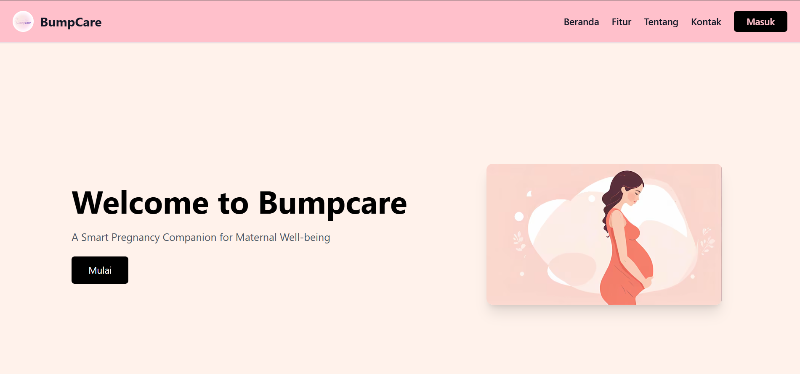

# 💙 BumpCare - Capstone Project

BumpCare adalah aplikasi web untuk membantu pemantauan status gizi dan risiko kesehatan mental ibu hamil. Aplikasi ini mengintegrasikan sistem backend, frontend, dan layanan machine learning untuk melakukan klasifikasi otomatis berbasis data pengguna.

---

## 📁 Struktur Proyek

```
.
├── bumpcare-backend/     # Backend Hapi.js (REST API)
├── bumpcare-frontend/    # Frontend React 19
├── ml-service/           # Layanan ML untuk klasifikasi
```

---

## 🚀 Fitur Utama

* Autentikasi pengguna (Login, Register)
* Profil pengguna dengan auto-fill data
* Kalkulator kehamilan
* Klasifikasi status gizi ibu hamil
* Klasifikasi risiko kesehatan mental
* Visualisasi data pemeriksaan
* Model Machine Learning dengan TensorFlow dan Scikit-learn

---

## 🔧 Tech Stack

### Frontend:

* React 19
* Tailwind CSS
* Lucide React, React Icons, React Markdown
* Vite

### Backend:

* Node.js + Hapi.js
* Joi (validasi)
* JWT (autentikasi)
* PostgreSQL

### Machine Learning Service:

* Flask
* TensorFlow
* Scikit-learn

Model:

* `model_status_gizi.h5`
* `mental_health_risk_model_full.h5`

---

## 🔧 Cara Menjalankan

### 1. Clone Repository

```bash
git clone https://github.com/yourusername/bumpcare-capstone-project.git
cd bumpcare-capstone-project
```

### 2. Jalankan Backend

```bash
cd bumpcare-backend
npm install
npm run dev
```

Siapkan file `.env` di direktori `bumpcare-backend/`:

```env
DB_HOST=localhost
DB_PORT=5000 
DB_USER=youruser
DB_PASS=yourpass
DB_NAME=bumpcare
DB_SSL=true/false
JWT_SECRET=your_jwt_secret
```

### 3. Jalankan Frontend

```bash
cd bumpcare-frontend
npm install
npm run dev
```

### 4. Jalankan ML Service

```bash
cd ml-service
pip install -r requirements.txt
python app.py
```

ML service akan berjalan di `http://localhost:5001`.

---

## 📌 Catatan Penting

* Jangan commit file `.env` ke GitHub.
* Semua komunikasi lintas service (frontend, backend, ML) harus pakai URL & port yang sesuai.
* Gunakan Postman atau frontend untuk uji endpoint REST.

---

## 👩‍💼 Tim Capstone

### Machine Learning (ML):

* **MC012D5X1208** - Tyas Nur Kumala - Telkom University
* **MC011D5X1270** - Maharani Rizki Febrianti - Universitas Padjadjaran
* **MC012D5Y2163** - Muhammad Hafizhuda - Telkom University

### Fullstack Developer (FEBE):

* **FC764D5Y0417** - Ageng Eko Widitya - Universitas Teknologi Bandung
* **FC764D5X0379** - Hikam Sirrul Arifin - Universitas Teknologi Bandung
* **FC764D5Y0732** - Naufal Pratista Sugandhi - Universitas Teknologi Bandung

---

## 📸 Tampilan Aplikasi

> 

---

## 📄 Lisensi

MIT License - Boleh digunakan untuk pembelajaran dan pengembangan pribadi atas izin developer.
